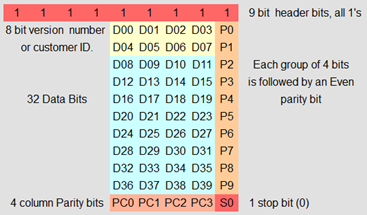

# 功能
当前从ID卡上读出EM410x TAG ID：06008148dd，需要写入到T5577卡上，没有现成的计算器，我就写了一个，数据格式参考下图：



# 用法:
python t5577.py 06008148dd

# 结果：
```
EM410x ID: 06008148DD
ABA:       0008472797
wiegand:   129, 18653

9 header bits:  111111111
8 customer ID:  00000 01100
32 Data Bits:   00000 00000 10001 00011 01001 10001 11011 11011
Parity bits:    00110
Block0: 00148040
Block1: FF818004
Block2: 4698EF66

Proxmark3 run command:
lf t55xx write -b 0 -d 00148040
lf t55xx write -b 1 -d FF818004
lf t55xx write -b 2 -d 4698EF66
lf t55xx detect
```
